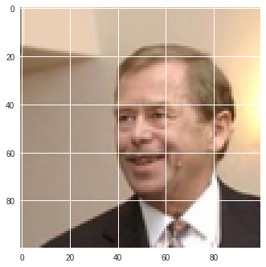
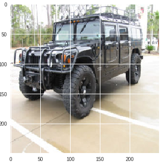
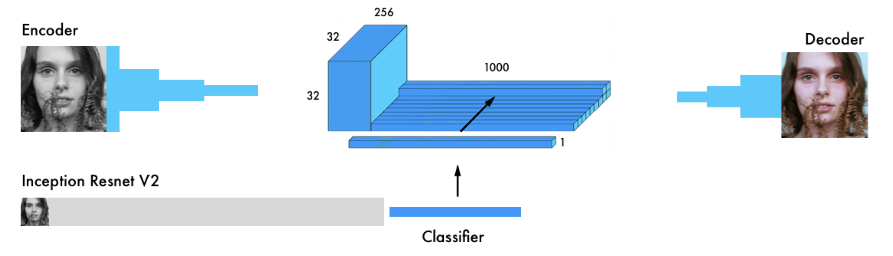

# Computer Vision

Practicas desarrolladas para la asignatura Visión por Computadora del Master IARFID de la UPV.

# **Practicas:**

## 1 Gender Recognition

Images from "Labeled Faces in the Wild" dataset (LFW) in realistic scenarios, poses and gestures. Faces are automatically detected and cropped to 100x100 pixels RGB.

**Training** set: 10585 images
**Test** set: 2648 images 

**Python code**: [here](scripts/gender.py)

**Goals:**
* Implement a model with >95% accuracy over test set
* Implement a model with >90% accuracy with less than 100K parameters
  
**Paper** [read](https://pdfs.semanticscholar.org/d0eb/3fd1b1750242f3bb39ce9ac27fc8cc7c5af0.pdf)
    

---
##  2 Car Model identification with bi-linear models:

Images of 20 different models of cars.

**Goals:**
* Load a pre-trained VGG16
* Connect this pre-trained model and form a bi-linear
* Train freezing weights or not
* Understand the above Keras implementations:
  * Name the layers
  * Built several models
  * Understand tensors sizes
  * Connect models with operations (outproduct)
  * Create an image generator that returns a list of tensors
  * Create a data flow with multiple inputs for the model
  * Understand the limitations of the proposed solution

**Jupyter Notebook**: [here](jupyter/bilinear/bilinear2.ipynb)
**Report** [read](trabajo%20final.pdf)

---

## 2 Image colorization

* **Python code**: Simple version [alpha version](jupyter/coloring/coloring_alpha.ipynb)

* **Python code**: Full version [here](jupyter/coloring/coloring_pro.ipynb)

**Goals:**
* How to load the inception net 
* How to merge encoder and inception result
* Use image functions to obtain lab space
* Create an appropiate  data augmentation 

**Paper** [Read](https://blog.floydhub.com/colorizing-b&w-photos-with-neural-networks/)

---

## 3 Style transfer

Content image

Style image

Result image

**Python Notebook**: [here](jupyter/styling/style.ipynb)

---

## Built With

* [Keras](https://github.com/keras-team/keras) - Frontend for Deeplearning
* [TensorFlow](https://github.com/tensorflow/tensorflow) - Bakend for Deeplearning

## Author

* **Sebastian Correa Echeverri** 
    * [gitlab](https://gitlab.com/scorrea92)
    * [github](https://github.com/scorrea92)

